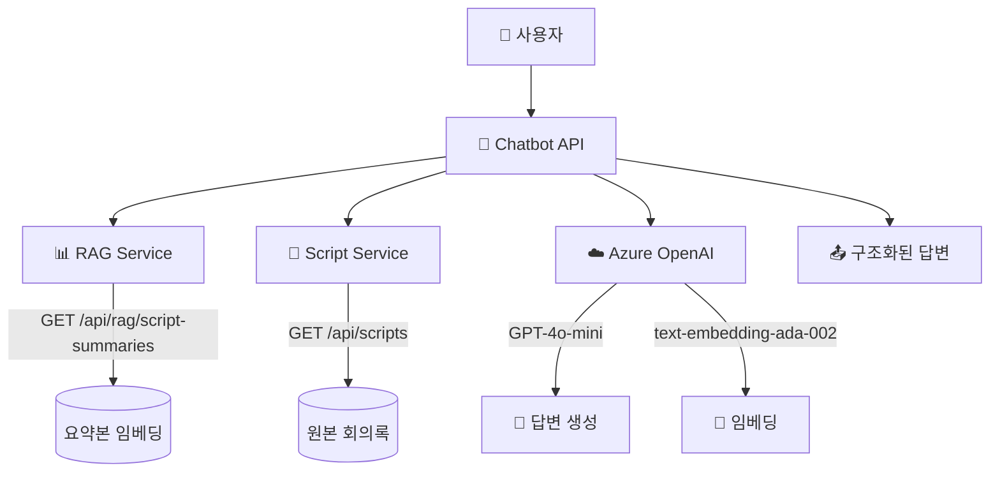
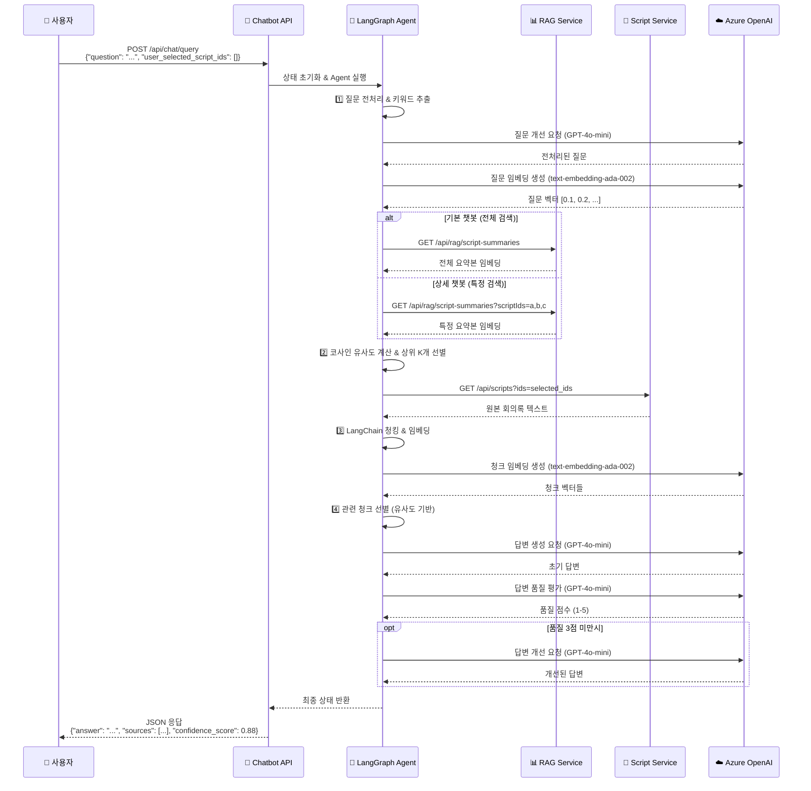
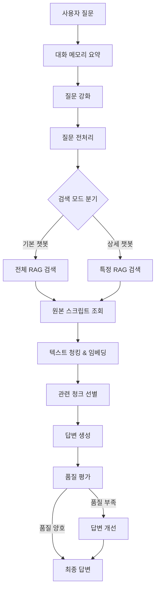

# 🤖 Meeting QA Chatbot API

> **MSA 기반 회의록 질의응답 시스템**  
> RAG(Retrieval Augmented Generation)와 Azure OpenAI를 활용한 지능형 회의록 검색 및 답변 생성 서비스

[](https://github.com/youngK-T/KT_KT_chat_bot.git)
[](https://python.org)
[](https://fastapi.tiangolo.com)
[](https://langchain.com)

## 📋 목차

- [🏗️ 시스템 아키텍처](#️-시스템-아키텍처)
- [✨ 주요 기능](#-주요-기능)
- [📁 프로젝트 구조](#-프로젝트-구조)
- [🚀 빠른 시작](#-빠른-시작)
- [📚 API 문서](#-api-문서)
- [🔄 Agent 워크플로우](#-agent-워크플로우)
- [🐳 Docker & 배포](#-docker--배포)
- [🔧 설정 가이드](#-설정-가이드)
- [🧪 테스트](#-테스트)
- [🚨 트러블슈팅](#-트러블슈팅)
- [📝 개발 노트](#-개발-노트)

---

## 🏗️ 시스템 아키텍처

### MSA 구조 다이어그램


### 데이터 플로우
```
1. 사용자 질문 → 2. RAG 검색 → 3. 원본 조회 → 4. 청킹/임베딩 → 5. 답변 생성
   (전처리)      (유사도 선별)   (다중 GET)    (LangChain)     (품질 평가)
```

### 상세 처리 시퀀스


---

## ✨ 주요 기능

### 🎯 **지능형 질의응답**
- **상황 인식**: 회의록 맥락을 이해한 정확한 답변
- **출처 추적**: 답변 근거가 된 문서와 위치 제공
- **신뢰도 점수**: AI가 자체 평가한 답변 품질 지표

### 🔍 **이중 검색 모드**
- **기본 챗봇**: 전체 회의록에서 관련 내용 검색
- **상세 챗봇**: 사용자 지정 회의록만 대상으로 검색

### 🧠 **고도화된 RAG 파이프라인**
- **단계별 처리**: 질문 전처리 → RAG → 원본 조회 → 청킹 → 답변
- **품질 관리**: 답변 평가 후 자동 개선 시도
- **메모리 관리**: 대화 맥락 유지 및 요약

### 🔄 **LangGraph 기반 워크플로우**
- **조건부 분기**: 사용자 선택에 따른 동적 경로
- **오류 복구**: 각 단계별 예외 처리 및 복구
- **상태 관리**: TypedDict 기반 명확한 데이터 흐름

---

## 📁 프로젝트 구조

```
KT_KT_chat_bot/
├── 📂 api/                     # FastAPI 웹 서버
│   ├── main.py                 # FastAPI 앱 설정
│   └── routes.py               # API 엔드포인트 정의
├── 📂 agents/                  # LangGraph Agent 시스템
│   ├── meeting_qa_agent_refactored.py  # 메인 Agent 오케스트레이터
│   └── steps/                  # Agent 처리 단계 모듈
│       ├── question_processing.py      # 1단계: 질문 전처리
│       ├── rag_search.py               # 2단계: RAG 검색
│       ├── script_fetch.py             # 3단계: 원본 스크립트 조회
│       ├── text_processing.py          # 4단계: 청킹/임베딩
│       ├── answer_generation.py        # 5단계: 답변 생성/개선
│       ├── quality_evaluation.py       # 6단계: 품질 평가
│       └── memory_management.py        # 대화 메모리 관리
├── 📂 models/                  # 데이터 모델
│   ├── state.py                # LangGraph State 정의
│   └── schemas.py              # Pydantic API 스키마
├── 📂 services/                # 외부 서비스 클라이언트
│   ├── rag_client.py           # RAG 서비스 통신
│   ├── blob_client.py          # Azure Blob Storage
│   └── postgres_client.py      # PostgreSQL 연결
├── 📂 utils/                   # 유틸리티 모듈
│   ├── embeddings.py           # 임베딩 생성/관리
│   └── text_processing.py      # 텍스트 전처리
├── 📂 config/                  # 설정 관리
│   ├── settings.py             # 환경 설정
│   └── api_key.txt             # API 키 (gitignore)
├── 📂 tests/                   # 테스트 코드
│   └── mock_data.py            # 테스트 데이터
├── 📂 .github/workflows/       # CI/CD 파이프라인
│   └── chatbot-CICD.yml        # GitHub Actions 워크플로우
├── 🐳 Dockerfile               # 컨테이너 이미지 정의
├── 📋 requirements.txt         # Python 의존성
├── 🚀 main.py                  # 애플리케이션 진입점
└── 📖 README.md               # 이 문서
```

---

## 🚀 빠른 시작

### 1️⃣ 환경 준비

```bash
# 저장소 클론
git clone <repository-url>
cd KT_KT_chat_bot

# 가상환경 생성 (권장)
python -m venv venv
source venv/bin/activate  # Windows: venv\Scripts\activate

# 의존성 설치
pip install -r requirements.txt
```

### 2️⃣ 환경 설정

`config/api_key.txt` 파일 생성:
```env
AZURE_OPENAI_API_KEY=your_azure_openai_key
AZURE_OPENAI_ENDPOINT=https://your-resource.openai.azure.com/
AZURE_OPENAI_API_VERSION=2025-01-01-preview
AZURE_OPENAI_DEPLOYMENT_NAME=o4-mini-250905
AZURE_OPENAI_EMBEDDING_DEPLOYMENT=text-embedding-ada-002
RAG_SERVICE_URL=https://your-rag-service.azurewebsites.net
MEETING_API_URL=https://your-script-service.azurewebsites.net
```

### 3️⃣ 서버 실행

```bash
# 프로덕션 실행
python main.py

# 개발 모드 (자동 재시작)
uvicorn api.main:app --reload --host 0.0.0.0 --port 8000
```

**🌐 접속 URL:**
- **API 서버**: http://localhost:8000
- **API 문서**: http://localhost:8000/docs
- **헬스체크**: http://localhost:8000/api/chat/health

---

## 📚 API 문서

### 🔗 **주요 엔드포인트**

| 메서드 | 경로 | 설명 | 인증 |
|--------|------|------|------|
| `POST` | `/api/chat/query` | 회의록 질의응답 | ❌ |
| `GET` | `/api/chat/health` | 서비스 상태 확인 | ❌ |
| `GET` | `/api/chat/status` | 상세 시스템 상태 | ❌ |
| `GET` | `/docs` | Swagger UI 문서 | ❌ |

### 📝 **질의응답 API**

**요청 예시:**
```bash
curl -X POST "http://localhost:8000/api/chat/query" \
  -H "Content-Type: application/json" \
  -d '{
    "question": "행안부 지능형 민원상담 시스템 1차 오픈 일정이 어떻게 조정됐어?",
    "user_selected_script_ids": []
  }'
```

**요청 스키마:**
```json
{
  "question": "사용자 질문 (필수, 최소 1자)",
  "user_selected_script_ids": ["script_id_1", "script_id_2"]  // 선택사항
}
```

**응답 스키마:**
```json
{
  "answer": "AI가 생성한 답변 텍스트",
  "sources": [
    {
      "script_id": "회의록 식별자",
      "meeting_title": "회의 제목 (선택사항)",
      "meeting_date": "회의 날짜 (선택사항)",
      "chunk_index": 3,
      "relevance_score": 0.95
    }
  ],
  "confidence_score": 0.88,
  "processing_steps": [
    "질문 전처리 완료",
    "RAG 검색 완료: 3개 관련 요약본 발견",
    "원본 스크립트 조회 완료: 2개",
    "청킹 및 임베딩 완료: 15개 청크 생성",
    "관련 청크 선별 완료: 5개 청크 선택",
    "최종 답변 생성 완료"
  ],
  "used_script_ids": ["script_id_1", "script_id_2"]
}
```

### 🔍 **검색 모드 설명**

1. **기본 챗봇** (`user_selected_script_ids: []`)
   - 전체 회의록 대상 검색
   - RAG 서비스에서 모든 요약본 조회 후 유사도 기반 선별

2. **상세 챗봇** (`user_selected_script_ids: ["id1", "id2"]`)
   - 지정된 회의록만 대상 검색
   - 특정 회의록들의 요약본만 조회

---

## 🔄 Agent 워크플로우

### LangGraph 기반 처리 파이프라인



### 📊 **각 단계별 상세 설명**

#### 1️⃣ **질문 전처리** (`question_processing.py`)
- **목적**: 검색 최적화를 위한 질문 명확화
- **처리**: 키워드 추출, 의도 분석, 검색 쿼리 최적화
- **출력**: `processed_question`, `search_keywords`

#### 2️⃣ **RAG 검색** (`rag_search.py`)
- **기본 모드**: `GET /api/rag/script-summaries` (전체 조회)
- **상세 모드**: `GET /api/rag/script-summaries?scriptIds=a,b,c` (다중 필터)
- **처리**: 코사인 유사도 계산, 상위 K개 선별
- **출력**: `relevant_summaries`, `selected_script_ids`

#### 3️⃣ **원본 스크립트 조회** (`script_fetch.py`)
- **API 호출**: `GET /api/scripts?ids=a,b,c` (쉼표 구분 다중 조회)
- **처리**: `scriptText` 추출 또는 `segments` 파싱
- **출력**: `original_scripts`

#### 4️⃣ **텍스트 처리** (`text_processing.py`)
- **청킹**: LangChain `RecursiveCharacterTextSplitter` 사용
- **임베딩**: Azure OpenAI `text-embedding-ada-002`
- **선별**: 질문과의 코사인 유사도 기반 Top-K
- **출력**: `chunked_scripts`, `relevant_chunks`

#### 5️⃣ **답변 생성** (`answer_generation.py`)
- **프롬프트**: 추출 기반 답변 생성 (엄격한 규칙)
- **제약**: 최대 512토큰, 출처 명시 필수
- **모델**: GPT-4o-mini (temperature=1, seed=1)
- **출력**: `final_answer`, `sources`, `used_script_ids`

#### 6️⃣ **품질 평가** (`quality_evaluation.py`)
- **평가 기준**: 정확성, 완성도, 관련성 (1-5점)
- **개선 조건**: 3점 미만 시 1회 개선 시도
- **출력**: `answer_quality_score`, `improvement_attempts`

---

## 🐳 Docker & 배포

### 🏗️ **Docker 빌드**

```bash
# 로컬 빌드
docker build -t chatbot-api .

# 멀티플랫폼 빌드 (Azure App Service 호환)
docker buildx build --platform linux/amd64 -t chatbot-api .

# 실행
docker run -p 8000:8000 chatbot-api
```

### ☁️ **Azure 배포**

**GitHub Actions 자동 배포:**
1. `main` 브랜치 푸시 시 자동 트리거
2. Docker 이미지 빌드 → Docker Hub 푸시
3. Azure Web App 자동 배포

**수동 배포:**
```bash
# Azure CLI 로그인
az login

# 컨테이너 배포
az webapp config container set \
  --name your-webapp-name \
  --resource-group your-resource-group \
  --docker-custom-image-name your-dockerhub-username/chatbot-api:latest
```

### 📋 **환경변수 설정 (Azure)**
```bash
az webapp config appsettings set \
  --name your-webapp-name \
  --resource-group your-resource-group \
  --settings \
    AZURE_OPENAI_API_KEY="your-key" \
    AZURE_OPENAI_ENDPOINT="https://your-resource.openai.azure.com/" \
    RAG_SERVICE_URL="https://your-rag-service.azurewebsites.net" \
    MEETING_API_URL="https://your-script-service.azurewebsites.net"
```

---

## 🔧 설정 가이드

### 🔑 **필수 환경변수**

| 변수명 | 설명 | 예시값 |
|--------|------|--------|
| `AZURE_OPENAI_API_KEY` | Azure OpenAI API 키 | `abc123...` |
| `AZURE_OPENAI_ENDPOINT` | Azure OpenAI 엔드포인트 | `https://resource.openai.azure.com/` |
| `AZURE_OPENAI_DEPLOYMENT_NAME` | GPT 모델 배포명 | `o4-mini-250905` |
| `AZURE_OPENAI_EMBEDDING_DEPLOYMENT` | 임베딩 모델 배포명 | `text-embedding-ada-002` |
| `RAG_SERVICE_URL` | RAG 서비스 URL | `https://rag.azurewebsites.net` |
| `MEETING_API_URL` | 회의록 서비스 URL | `https://script.azurewebsites.net` |

### ⚙️ **선택적 설정**

```python
# config/settings.py에서 조정 가능
DEFAULT_RAG_TOP_K = 5                    # RAG 검색 결과 개수
DEFAULT_SIMILARITY_THRESHOLD = 0.7       # 유사도 임계값
DEFAULT_CHUNK_SIZE = 1000                # 텍스트 청크 크기
DEFAULT_CHUNK_OVERLAP = 200              # 청크 간 중복 크기
```

### 🔗 **외부 서비스 요구사항**

#### **RAG 서비스 API**
```
GET /api/rag/script-summaries              # 전체 요약본 조회
GET /api/rag/script-summaries?scriptIds=a,b,c  # 다중 조회

응답 형식:
[
  {
    "scriptId": "string",
    "embedding": [0.1, 0.2, ...]
  }
]
```

#### **회의록 서비스 API**
```
GET /api/scripts?ids=a,b,c                # 다중 원본 조회

응답 형식:
[
  {
    "scriptId": "string",
    "scriptText": "회의 내용...",
    "storageUrl": "https://...",
    "segments": [
      {"speaker": "홍길동", "text": "안녕하세요"}
    ]
  }
]
```

---

## 🧪 테스트

### 🖥️ **로컬 테스트**

```bash
# Gradio UI 테스트
python test_ui.py

# 브라우저에서 접속: http://localhost:7860
```

### 🌐 **API 테스트**

**JavaScript 콘솔 테스트:**
```javascript
fetch('https://your-app.azurewebsites.net/api/chat/query', {
  method: 'POST',
  headers: { 'Content-Type': 'application/json' },
  body: JSON.stringify({
    question: '테스트 질문입니다',
    user_selected_script_ids: []
  })
}).then(r => r.json()).then(console.log);
```

**curl 테스트:**
```bash
curl -X POST "https://your-app.azurewebsites.net/api/chat/query" \
  -H "Content-Type: application/json" \
  -d '{"question": "테스트 질문", "user_selected_script_ids": []}'
```

### 🔍 **헬스체크**
```bash
# 서비스 상태 확인
curl https://your-app.azurewebsites.net/api/chat/health

# 상세 시스템 상태
curl https://your-app.azurewebsites.net/api/chat/status
```

---

## 🚨 트러블슈팅

### ❌ **일반적인 오류**

#### **1. `unsupported operand type(s) for +: 'NoneType' and 'int'`**
- **원인**: State의 숫자 필드가 None으로 초기화됨
- **해결**: `api/routes.py`에서 초기값 설정 확인
```python
"conversation_count": 0,
"answer_quality_score": 0, 
"improvement_attempts": 0
```

#### **2. `temperature' does not support 0.1 with this model`**
- **원인**: GPT-4o-mini 모델이 temperature=1만 지원
- **해결**: `temperature=1` 고정, 프롬프트로 출력 제어
```python
self.llm = AzureChatOpenAI(
    temperature=1,  # 고정값
    max_tokens=512,
    model_kwargs={"seed": 1}  # 일관성 확보
)
```

#### **3. `Method Not Allowed (405)`**
- **원인**: GET 요청을 POST 엔드포인트에 전송
- **해결**: 올바른 HTTP 메서드 사용
```bash
# 잘못된 예
curl https://api.com/api/chat/query

# 올바른 예  
curl -X POST https://api.com/api/chat/query -d '{"question":"..."}'
```

#### **4. `object of type 'NoneType' has no len()`**
- **원인**: 응답 생성 시 None 값 처리 미흡
- **해결**: 안전한 길이 계산 함수 사용
```python
def _count(v):
    return len(v) if v is not None else 0
```

### 🔧 **성능 최적화**

#### **응답 시간 개선**
1. **RAG 검색 최적화**: 유사도 임계값 조정 (0.7 → 0.75)
2. **청킹 크기 조정**: 큰 문서는 청크 크기 증가 (1000 → 1500)
3. **병렬 처리**: 외부 API 호출 시 asyncio 활용

#### **메모리 사용량 최적화**
1. **임베딩 캐시**: 동일 텍스트 재사용 시 캐싱
2. **청크 제한**: 관련 청크 상위 5개로 제한
3. **상태 정리**: 처리 완료 후 불필요한 데이터 제거

### 📊 **모니터링**

#### **로그 확인**
```bash
# Docker 컨테이너 로그
docker logs container-name

# Azure App Service 로그
az webapp log tail --name your-app --resource-group your-rg
```

#### **주요 메트릭**
- **응답 시간**: 평균 5-10초 (정상)
- **성공률**: 95% 이상 (목표)
- **메모리 사용량**: 512MB 이하 (컨테이너 제한)

---

## 📝 개발 노트

### 🏛️ **아키텍처 원칙**
- **MSA 설계**: 서비스 간 느슨한 결합
- **상태 불변성**: LangGraph State의 명시적 관리
- **오류 격리**: 각 단계별 독립적 예외 처리
- **확장성**: 모듈 기반 구조로 기능 추가 용이

### 🔄 **버전 히스토리**
- **v2.2.1**: API 엔드포인트 변경 (`/api/chat/*`)
- **v2.2.0**: script_id 일관성 개선, 품질 평가 강화
- **v2.1.0**: LangGraph 기반 리팩토링
- **v2.0.0**: MSA 아키텍처 전환
- **v1.0.0**: 초기 버전

### 🛠️ **기술 스택**
- **웹 프레임워크**: FastAPI 0.104.1
- **AI 오케스트레이션**: LangGraph 0.2.3
- **LLM 통합**: LangChain 0.2.16
- **AI 모델**: Azure OpenAI (GPT-4o-mini, text-embedding-ada-002)
- **컨테이너화**: Docker (멀티스테이지 빌드)
- **배포**: Azure Web App + GitHub Actions
- **모니터링**: Azure Application Insights (선택사항)

### 🎯 **향후 개선사항**
1. **캐싱 시스템**: Redis를 활용한 임베딩/응답 캐시
2. **스트리밍 응답**: 실시간 답변 생성 스트리밍
3. **다국어 지원**: 영어/일본어 회의록 처리
4. **고급 RAG**: 하이브리드 검색 (키워드 + 벡터)
5. **사용자 피드백**: 답변 품질 학습 시스템

### 🤝 **기여 가이드**
1. **코드 스타일**: Black + isort 사용
2. **테스트**: 새 기능 시 단위 테스트 필수
3. **문서화**: docstring과 타입 힌트 작성
4. **브랜치 전략**: feature/* → develop → main

---

## 📞 지원 및 문의

- **이슈 리포트**: [GitHub Issues](https://github.com/your-repo/issues)
- **기능 요청**: [GitHub Discussions](https://github.com/your-repo/discussions)
- **보안 문제**: security@your-domain.com

---

<div align="center">

**🚀 Made with ❤️ using FastAPI, LangChain & Azure OpenAI**

[](https://github.com/your-repo)
[](https://your-app.azurewebsites.net)
[](https://hub.docker.com/r/your-username/chatbot-api)

</div>