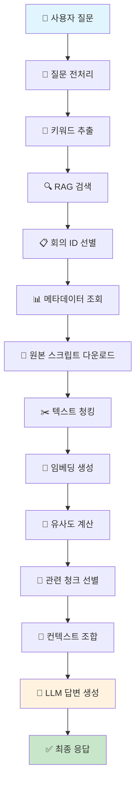

# Meeting QA API

회의록을 기반으로 한 질의응답 시스템 API입니다. MSA 환경에서 RAG와 Azure 서비스들을 활용하여 정확한 답변을 제공합니다.

## 🏗️ 아키텍처

```
graph TD
    A[사용자 질문] --> B[질문 전처리]
    B --> C[키워드 추출]
    C --> D[RAG 검색]
    D --> E[회의 ID 선별]
    E --> F[메타데이터 조회]
    F --> G[원본 스크립트 다운로드]
    G --> H[텍스트 청킹]
    H --> I[임베딩 생성]
    I --> J[유사도 계산]
    J --> K[관련 청크 선별]
    K --> L[컨텍스트 조합]
    L --> M[LLM 답변 생성]
    M --> N[최종 응답]
```

## 📁 프로젝트 구조

```
KT_KT_chat_bot/
├── 📁 config/              # 설정 관리
│   ├── settings.py         # 환경설정
│   └── api_key.txt        # API 키 (gitignore)
├── 📁 models/              # 데이터 모델
│   ├── state.py           # Agent State 정의
│   └── schemas.py         # Pydantic 스키마
├── 📁 agents/              # Agent 로직
│   └── meeting_qa_agent.py # 메인 QA Agent
├── 📁 services/            # 외부 서비스 클라이언트
│   ├── rag_client.py      # RAG 서비스
│   ├── postgres_client.py # PostgreSQL
│   └── blob_client.py     # Azure Blob Storage
├── 📁 utils/               # 유틸리티
│   ├── text_processing.py # 텍스트 처리
│   └── embeddings.py      # 임베딩 관리
├── 📁 api/                 # FastAPI 서버
│   ├── main.py            # FastAPI 앱
│   └── routes.py          # API 라우트
├── 📁 tests/               # 테스트 코드
├── 📄 main.py              # 실행 엔트리포인트
├── 📄 requirements.txt     # 의존성
├── 📄 test_ui.py          # Gradio 테스트 UI
└── 📄 README.md           # 이 파일
```

## 🚀 실행 방법

### 1. 의존성 설치
```bash
pip install -r requirements.txt
```

### 2. API 키 설정
`config/api_key.txt` 파일을 생성하고 Azure OpenAI 설정을 입력:
```
AZURE_OPENAI_API_KEY=your_api_key
AZURE_OPENAI_ENDPOINT=https://your-resource.openai.azure.com/
AZURE_OPENAI_API_VERSION=2024-02-15-preview
AZURE_OPENAI_DEPLOYMENT_NAME=your_deployment_name

# 외부 서비스 URL 설정
RAG_SERVICE_URL=https://your-rag-service.azurecontainerapps.io
MEETING_API_URL=https://your-meeting-api.azurecontainerapps.io
```

### 3. 서버 실행
```bash
python main.py
```

서버가 시작되면:
- API: http://localhost:8000
- 문서: http://localhost:8000/docs
- 헬스체크: http://localhost:8000/api/v1/health

## 📋 API 사용법

### 회의록 질의응답
```bash
POST /api/v1/meeting-qa
Content-Type: application/json

{
    "question": "지난 주 회의에서 결정된 마케팅 전략은?"
}
```

> **참고**: 외부 서비스 URL들은 `config/api_key.txt`에서 환경변수로 관리됩니다.

### 응답 예시
```json
{
    "answer": "지난 주 회의에서는 소셜미디어 중심의 마케팅 전략이 결정되었습니다...",
    "sources": [
        {
            "meeting_id": "MEETING_2024_0101_001",
            "meeting_title": "마케팅 전략 회의",
            "meeting_date": "2024-01-01",
            "chunk_index": 3,
            "relevance_score": 0.95
        }
    ],
    "confidence_score": 0.88,
    "processing_steps": [
        "질문 전처리 완료",
        "RAG 검색 완료: 3개 관련 요약본 발견",
        "DB 조회 완료: 2개 원본 스크립트 획득",
        "청킹 및 임베딩 완료",
        "관련 청크 선별 완료",
        "최종 답변 생성 완료"
    ]
}
```

7. **답변 생성**: LLM을 통한 최종 답변 생성

### 📊 데이터 흐름 다이어그램



### 🔧 기술 스택

#### **AI 모델 (Azure OpenAI)**
- **GPT-4o-mini**: 질문 전처리, 답변 생성
- **text-embedding-ada-002**: 벡터 임베딩

#### **외부 서비스**
- **RAG 서비스**: 요약본 검색
- **회의록 API**: 메타데이터/원본 텍스트 조회

#### **처리 기술**
- **청킹**: 긴 텍스트를 1000자 단위로 분할 (200자 오버랩)
- **임베딩**: 텍스트를 1536차원 벡터로 변환
- **코사인 유사도**: 질문과 청크 간 관련성 계산 (임계값: 0.6)

### 💡 핵심 아키텍처 특징

1. **🔄 다단계 검색**: RAG → 메타데이터 → 원본 스크립트
2. **🎯 의미 검색**: 임베딩으로 관련 부분만 추출
3. **⚡ 컨텍스트 최적화**: 토큰 제한 내에서 최대한 관련 정보 활용
4. **📊 상태 관리**: LangGraph로 각 단계 결과 추적
5. **🏗️ MSA 구조**: 독립적인 마이크로서비스들과 HTTP 통신

